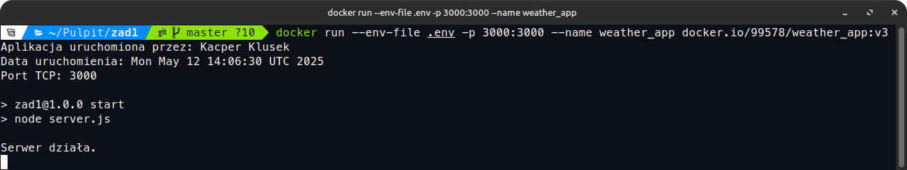
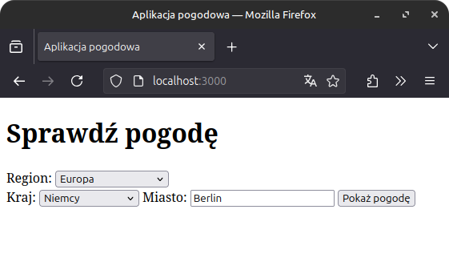
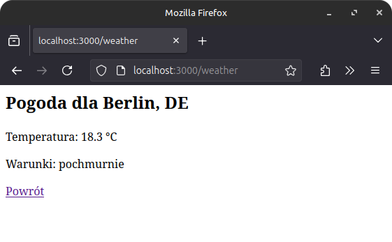

## 1.1. KOD ŹRÓDŁOWY APLIKACJI SERWERA ('SERVER.JS')

require('dotenv').config();
const express = require('express');
const path = require('path');

const app = express();

const PORT = process.env.PORT || 3000;

app.use(express.urlencoded({ extended: true }));

app.get('/', (req, res) => {
    res.sendFile(path.join(__dirname, "index.html"))
})

app.post('/weather', async (req, res) => {
    const city = req.body.city;
    const country = req.body.country;
    const apiKey = process.env.OPENWEATHER_API_KEY;

    const query = `${city},${country}`;
    const url = `https://api.openweathermap.org/data/2.5/weather?q=${encodeURIComponent(query)}&appid=${apiKey}&units=metric&lang=pl`;

    try {
        const response = await fetch(url);
        if (!response.ok) {
            throw new Error('Nie znaleziono lokalizacji lub błąd API.');
        }
        const data = await response.json();
        res.send(`
            <h2>Pogoda dla ${data.name}, ${data.sys.country}</h2>
            
Temperatura: ${data.main.temp} °C

            
Warunki: ${data.weather[0].description}

            <a href="/">Powrót</a>
        `);
    } catch (error) {
        res.send(`
Błąd: ${error.message}
<a href="/">Spróbuj ponownie</a>`);
    }
});

app.listen(PORT, () => {
    console.log(`Serwer działa.`);
});

## 1.2. KOD ŹRÓDŁOWY STRONY HTML ('INDEX.HTML')

<!DOCTYPE html>
<html lang="pl">
<head>
    <meta charset="UTF-8">
    <title>Aplikacja pogodowa</title>
    
</head>
<body>
    <h1>Sprawdź pogodę</h1>
    <form method="POST" action="/weather">

        <!-- Kontynent -->
        <label for="continent">Region:</label>
        <select id="continent" required>
            <option value="">-- Wybierz region --</option>
            <option value="europe">Europa</option>
            <option value="asia">Azja</option>
            <option value="america">Ameryka</option>
            <option value="africa">Afryka</option>
            <option value="oceania">Australia i Oceania</option>
        </select>

        <!-- Ukrywana część formularza -->
        

            <!-- Kraj -->
            <label for="country">Kraj:</label>
            <select id="country" name="country" required>
                <option value="">-- Wybierz kraj --</option>
            </select>

            <!-- Miasto -->
            <label for="city">Miasto:</label>
            <input type="text" id="city" name="city" required>

            <!-- Przycisk -->
            <button type="submit">Pokaż pogodę</button>
        

    </form>

    
</body>
</html>

## 2. KOD PLIKU DOCKERFILE

# Etap 1: Budowanie aplikacji
FROM node:18-alpine AS build
# Autor aplikacji
LABEL author="Kacper Klusek"
# Ustawienie katalogu roboczego
WORKDIR /app
# Skopiowanie plików package.json i package-lock.json
COPY package*.json ./
# Instalacja zależności
RUN npm install
# Skopiowanie reszty aplikacji
COPY . .

# Etap 2: Uruchomienie aplikacji
FROM node:18-alpine
# Ustawienie katalogu roboczego
WORKDIR /app
# Skopiowanie tylko wymaganych plików z etapu budowania
COPY --from=build /app /app
# Eksponowanie portu na którym nasłuchuje aplikacja
EXPOSE 3000
# Uruchomienie aplikacji, logowanie daty uruchomienia, autora i portu
CMD echo "Aplikacja uruchomiona przez: Kacper Klusek" && \
    echo "Data uruchomienia: $(date)" && \
    echo "Port TCP: 3000" && \
    npm start
# Healthcheck
HEALTHCHECK --interval=30s --timeout=10s --retries=3 \
    CMD curl --silent --fail http://localhost:3000 || exit 1

## 3.1. POLECENIE BUDOWY OBRAZU

docker build -f Dockerfile -t 99578/weather_app:v3 .

## 3.2. POLECENIE URUCHOMIENIA OBRAZU

docker run --env-file .env -p 3000:3000 --name weather_app docker.io/99578/weather_app:v3

## 3.3. POLECENIE POZYSKANIA LOGÓW

docker logs weather_app

## 3.4. POLECENIA O ILOŚCI WARSTW I ROZMIARZE OBRAZU

docker image history docker.io/99578/weather_app:v3
docker image inspect docker.io/99578/weather_app:v3 --format='{{.Size}}'

## 4. SCREENY Z DZIAŁANIA APLIKACJI

