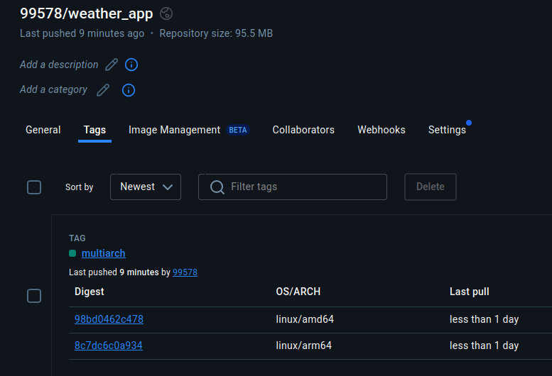
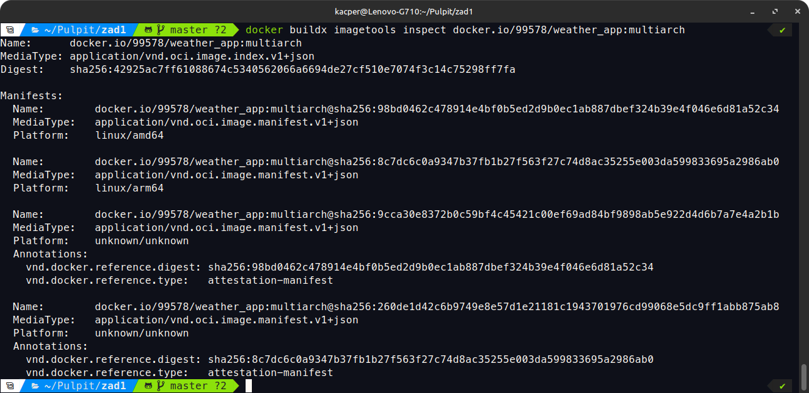
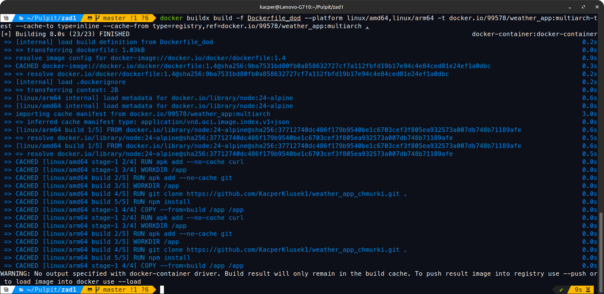

## 1. UTWORZENIE BUILDERA 

docker buildx create --name docker-container --driver docker-container --use

## 2. KOD DOCKERFILE_DOD

# syntax=docker/dockerfile:1.4
# Etap 1: Budowanie aplikacji
FROM node:18-alpine AS build
# Autor aplikacji
LABEL author="Kacper Klusek"
# Instalacja git
RUN apk add --no-cache git
# Ustawienie katalogu roboczego
WORKDIR /app
# Pobranie repozytorium
RUN git clone https://github.com/KacperKlusek1/weather_app_chmurki.git .
# Instalacja zależności
RUN npm install

# Etap 2: Uruchomienie aplikacji
FROM node:18-alpine
# Instalacja curl
RUN apk add --no-cache curl
# Ustawienie katalogu roboczego
WORKDIR /app
# Kopiowanie plików z etapu build
COPY --from=build /app /app
# Eksponowanie portu na którym nasłuchuje aplikacja
EXPOSE 3000
# Uruchomienie aplikacji, logowanie daty uruchomienia, autora i portu
CMD echo "Aplikacja uruchomiona przez: Kacper Klusek" && \
    echo "Data uruchomienia: $(date)" && \
    echo "Port TCP: 3000" && \
    npm start
# Healthcheck
HEALTHCHECK --interval=30s --timeout=10s --retries=3 \
    CMD curl --silent --fail http://localhost:3000 || exit 1

## 3. ZBUDOWANIE OBRAZÓW

docker buildx build -f Dockerfile_dod --platform linux/amd64,linux/arm64 -t docker.io/99578/weather_app:multiarch --push --cache-to type=inline --cache-from type=registry,ref=docker.io/99578/weather_app:multiarch .

## 4. POTWIERDZENIE DEKLARACJI DWÓCH ARCHITEKTUR SPRZĘTOWYCH

## 5. POTWIERDZENIE DZIAŁAJĄCEGO CACHE

